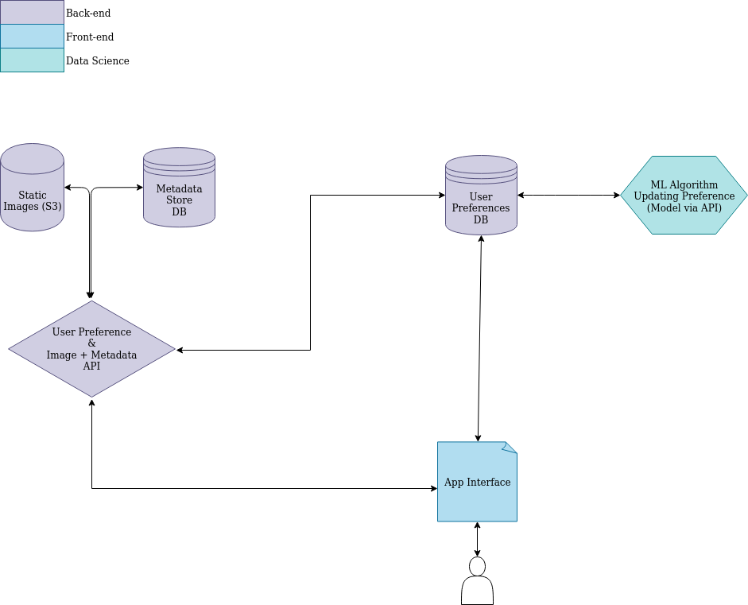

# What is this?

The MVP will be the following: a small app which allows a user to swipe left or right to get closer and closer to a potential breed or breeds of dogs which satisfy restricions and criteria they may desire.

Tl;dr, dog tinder.


# Things Which Need to Be Done for 1.0.

## Current Dataset

We're trimming down the Stanford Dog Dataset, available [here](http://vision.stanford.edu/aditya86/ImageNetDogs/).

## Current UML Diagrams

Up-to-date image is [here](https://drive.google.com/file/d/1ms-_3d8jwr2HgldPu0LXKj6-48fXoz6r/view?usp=sharing).



### Machine Learning

- [ ] Storage of many (5000?) dog pictures from common or uncommon breeds in some proportion.
- [x] What initial features should be in the metadata for dog breeds?
- [ ] Score adjustments for swiping left or right w/rt the metadata items (eg, swipe right on a happy dog with pointy nose gives +2 to happy or +2 to pointy nose or...?)
- [ ] ML algorithm to figure out next dog.
- [ ] ML algorith to give current "top 3" dogs for a user.

### App Development

- [ ] Responsive app.
- [ ] Card sliding ability (with emits for left- and right-swipe) to yea or nay on a particular asset.

### API Development

- [x] API call for getting dog pics
- [ ] API call for getting dog metadata
- [x] API call for getting user data
- [ ] API call for modifying user data

### Database Development

- [x] Choose structure for dog metadata DB.
- [x] Choose structure for user metadata DB.
- [x] What metadata for dogs?
- [ ] What metadata for users?
- [x] Create temp DB with docker-compose to test.
- [ ] How much data should be stored, how much should be transient?
- [ ] How do we update user preferences in the db without putting a whole lot of info into it?

# I'm Developing on this, What Do I Need to Do?

- Ticket board is [here in github projects](https://github.com/jsal13/tinder-for-dogs/projects/1).
- We use [conventional commits whenever possible](https://www.conventionalcommits.org/en/v1.0.0-beta.2/). If you're not sure how to use these, ask! It's pretty easy and very useful once you get going!
- You will almost certainly need Docker and Docker-Compose. Google this and download it. It's a fun time!

## Python Side Dev:

**Note: To make things easier, please allow your IDE to format with standard Black options on save.**

Go into the repo and run the following:

```bash
pip install pre-commit
pre-commit install
```

This will install the precommit linter, Black. When you commit, it will fix any files which needed linting. This will require you to add the newly linted files and commit again --- note, you may use the previous commit, since that commit will have failed. (See `git logs --oneline` if you don't know what I mean here.)

## Node Side Dev:

Idk lol

## General Dev:

- Don't be a jerk.
- Pls like dogs.

### Contribution Team

Right now we don't have a NEWS or UPDATES file so we can't give credit there. So here's a list of people helping out! We appreciate you all, no matter the work done. :')

- jsal13 (useless)
- Crazyglue (frontend-backend hero)
- kelseight (dog photo expert)
